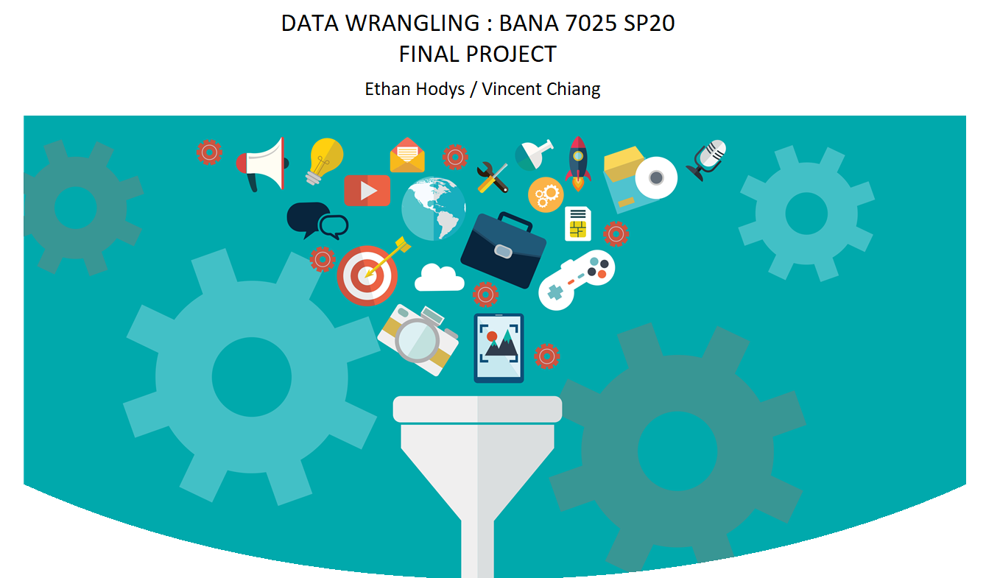
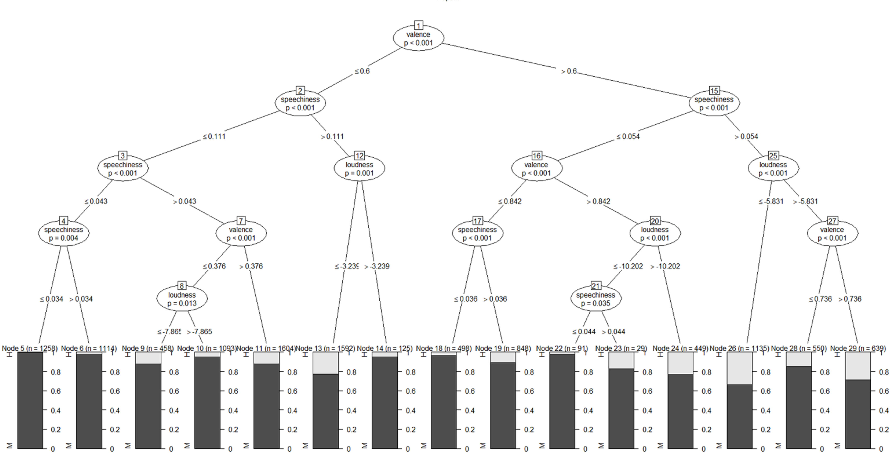

```{r setup, include=FALSE}
library(flexdashboard)
library(knitr)
library(dlookr)
library(dplyr)
library(tidyverse) # general utility functions
library(purrr)
library(tidyr)
library(ggplot2)
library(DT)
library(rsconnect)
library(corrplot)
library(shiny)
```

```{r global, include=FALSE}
# load data in 'global' chunk so it can be shared by all users of the dashboard
spotify.raw <- readr::read_csv("finalproject.data.csv")
```


Sidebar {.sidebar}
=======================================================================

### Input Controls

For use on Dashboard Tabs only


```{r}

sliderInput("sliderInputVal", "Count:",
            min = 0, max = 50, value = 5, step = 1.0
)

EoTR = data.frame(Genres=spotify.raw$playlist_genre,
              Subgenres=spotify.raw$playlist_subgenre)

selectInput("genreInput", label = "Genres",
          choices = c("All", levels(EoTR$Genres)), selected = "All")

# selectInput("subgenreInput", label = "Sub-Genres",
#           choices = c("All", levels(EoTR$Subgenres)), selected = "All")

# # Maximum number of raw data rows to keep
# numericInput("maxrows", "Recent downloads window:", 50)
```

About
=======================================================================

Row { }
-----------------------------------------------------------------------

````{r, fig.width=9, fig.height=10}

```


Introduction 
=======================================================================

Row { data-height: 100 }
-------------------------------------

### About Spotify
Founded in 2006, Spotify's primary business is providing an audio streaming platform, the "Spotify" platform, that provides DRM-restricted music, videos and podcasts from record labels and media companies (Wikipedia 2008).  This paper is an exploratory survey of whether musical features and characteristics can be used predict how a song will be both received and classified by Spotify users.  Using different methods for Classification Trees and Clustering in R, we make a case for the feasibility of prediction using a song's meta data stored by Spotify.

```{r}

```

Row { data-height: 100}
-------------------------------------
   
### Project Abstract

Music can have a powerful effect upon people emotionally and has played an important role in since the first human society.  Thus, being able to classify songs based on their musical features could prove to be a useful tool across many sectors.  While this paper will in no way be an exhaustive survey of the topic it will provide an initial exploratory analysis to help guide future research
We have chosen to use the "Spotify Song Attributes" data set on Kaggle uploaded by George McIntire under a CC-BY License.  Below is a list of the variables in the dataset with their distributions except for "track id" which is simply a unique identifier for a song (see appendix for details on the dataset). 

we found it challenging to tell an interesting store with this dataset so to offset this we made sure to implement this in flexdashboard and deploy to shinyapp.io.  We believed that the "story" was in letting the user explore the dataset themselves using different input parameters on the side nav.  Our hard sell is that the store behind the spotify dataset is a "choose your own adventure" book from elementary school.
 
We also added information on the biological sex of the performers using lists of popular names split between boy in girl.  We import the data into MS Sql Server to add the correct value for the new variable "isMale" which is a simple bit variable of 0/1 for female/male, respectively.

Packages 
=======================================================================

Row { data-height: 200 }
-------------------------------------
### Project Libraries


- library(flexdashboard)
- library(knitr)
- library(dlookr)
- library(dplyr)
- library(tidyverse) # general utility functions
- library(purrr)
- library(tidyr)
- library(ggplot2)
- library(corrplot)

Datatable
=======================================================================

Row {}
-----------------------------------------------------------------------

### Datatable
</br>
</br>

```{r}

mydata <- spotify.raw[,12:20]
DT::datatable(mydata )
#renderDataTable({
#DT::datatable(order[1: as.numeric(input$sliderInputVal),])
# mydata <- mydata[1:as.numeric(input$sliderInputVal),]
  #DT::datatable(mydata )
#})

```


Exploration
=======================================================================

Column {data-width=650}
-----------------------------------------------------------------------

### Histogram of Dataset Variables


```{r}
spotify.raw %>%
  keep(is.numeric) %>% 
  gather() %>% 
  ggplot(aes(value)) +
  facet_wrap(~ key, scales = "free") +
  geom_histogram(color = "#e9ecef")
```

More Exploration
=======================================================================

Column {data-width=650}
-----------------------------------------------------------------------

### Histogram of Dataset Variables


```{r}
col=c(4,12:24)
data <- spotify.raw
cordata=data[,col]
datacor=cor(cordata)

corrplot(datacor, type="upper")
box1=boxplot(cordata$danceability, main= "Danceability")
box2=boxplot(cordata$energy, main="Energy")
box3=boxplot(cordata$key, main="Key")        
box4=boxplot(cordata$loudness, main="Loudness")
box5=boxplot(cordata$speechiness, main = "Speechiness")
box6=boxplot(cordata$acousticness, main="Acousticness")
box7=boxplot(cordata$liveness, main = "Liveness")
box8=boxplot(cordata$valence, main = "Valence")
box9=boxplot(cordata$tempo, main = "Tempo")
```

Dashboard - General
=======================================================================


Row { }
-------------------------------------
   
### Table of Genre Counts


```{r}
spotify.raw %>% 
  count(Genre=playlist_genre) %>%
   knitr::kable()
```
    
### Table of Sub-Genre Counts

```{r}
spotify.raw %>% 
  count(Subgenre = playlist_subgenre) %>%
  slice(1:7) %>%
   knitr::kable()
```

### Density
```{r}

renderPlot({
    spotify.filtered <- spotify.raw
feature_names <- names(spotify.raw)[12:23]

  if(input$genreInput != 'All')
  {
    spotify.filtered <- spotify.raw[ which(spotify.raw$playlist_genre==input$genreInput),]
    order <-  spotify.filtered %>%
                group_by(track_id,Song=track_name,Popularity=track_popularity,Artist=track_artist, Genre=playlist_genre,
                Album=track_album_name, Relase_Date = track_album_release_date)
  }
  else
  {
    order <-  spotify.filtered %>%
                  group_by(track_id,Song=track_name,Popularity=track_popularity,Artist=track_artist,
                  Album=track_album_name, Relase_Date = track_album_release_date)
  }


library(dplyr)
order %>%
  select(c('playlist_genre', feature_names)) %>%
  pivot_longer(cols = feature_names) %>%
  ggplot(aes(x = value)) +
  geom_density(aes(color = playlist_genre), alpha = 0.5) +
  facet_wrap(~name, ncol = 3, scales = 'free') +
  labs(title = 'Spotify Audio Feature Density - by Genre',
       x = '', y = 'density') +
  theme(axis.text.y = element_blank())
})
  
```


Row { }
-------------------------------------

### N Most Popular

```{r}
# order <- spotify.raw %>%
#   #arrange(desc(track_popularity))
#   group_by(track_name) %>%
#   top_n(100,track_popularity) %>%
#   select(track_name, track_artist, track_popularity) %>%
#   slice(1:10) 
renderDataTable({
  spotify.filtered <- spotify.raw
  
  if(input$genreInput != 'All')
  {
    spotify.filtered <- spotify.raw[ which(spotify.raw$playlist_genre==input$genreInput),]
    order <-  spotify.filtered %>%
                group_by(track_id,Song=track_name,Popularity=track_popularity,Artist=track_artist, Genre=playlist_genre,
                Album=track_album_name, Relase_Date = track_album_release_date)
  }
  else
  {
    order <-  spotify.filtered %>%
                  group_by(track_id,Song=track_name,Popularity=track_popularity,Artist=track_artist,
                  Album=track_album_name, Relase_Date = track_album_release_date)
  }

order <-  order %>%
   summarise(n_distinct(10,track_id)) %>%
   arrange(desc(Popularity))  %>%
  top_n(100,Popularity)


  #select(track_id, count(track_id))
# ugh <- order %>% 
#   top_n(10, track_popularity)


#%>%
  # top_n(100,track_popularity) %>%
  # select(track_name, track_artist, track_popularity) %>%
  #slice(1:20)  
  #top_n(20,desc(track_popularity))

##Apply the Input Parameters


 # finalTable <- order[1: as.numeric(input$sliderInputVal),2:6]
  finalTable <- order[1: as.numeric(input$sliderInputVal),2:7]
  

  
  # finalTable <- finalTable %>%
  #                filter(playlist_genre==genreInput)
DT::datatable(finalTable)
})
```

Decision Tree
=======================================================================
Row {data-width=350}
-----------------------------------------------------------------------

### CTREE() Analysis
The output graph below is for the ctree() analysis for "Danceability".  This is for a classification of "highly danceable" being the top 20th percentile of the danceability variable.  These plots are more powerful than those generated with rpart as the decision paths lead to a probability distribution of the classification categories.  'H' is defined as "Highly Danceable".
	We can see from the graph that the left-most bin indicates a path for a song that is predicted to have 0% danceability.  In contrast, the 3rd distribution from the right shows an approximate 35% chance of such a song being classified as "Highly Danceable" by our metric/feature definition.  Going one step further, we have an approximate 35% chance of producing a "Highly Danceable" song if we give it the characteristics of [a] variance > 0.6, [b] speechiness > .54, [c] loudness <= -5.832

### Code Snippet

library(party)
cut <- .80
data.tree <- mutate(data.tree, dancebin = factor(case_when(danceability >= cut ~ "H",
                                                                       #danceability < cut ~ "M",
                                                                       TRUE                ~ "M")))

fit <- ctree(dancebin ~ energy +  danceability  + loudness + acousticness,    
             data=data.tree.train)
print(fit)
windows(20,20)
plot(fit, main="Popularity: Cutoff = 80%")
predictions <- predict(fit, data.tree.test)

Row { }
-----------------------------------------------------------------------
````{r, fig.width=10, fig.height=10}

```


Project Summary
=======================================================================

Row {data-width=350}
-----------------------------------------------------------------------

### Summary

- Used Flexdashboard
- Used Data Input within Flexdashboard
- Use dplyr techniques from class for creating bins of variables such as danceability and popularity
- Deployed to personal shinyapps.io site via rsconnect()
- Deployed code to GitHub for source control and collaboration
- Used Decition tree using ctree() from our Data Mining II Final Project
