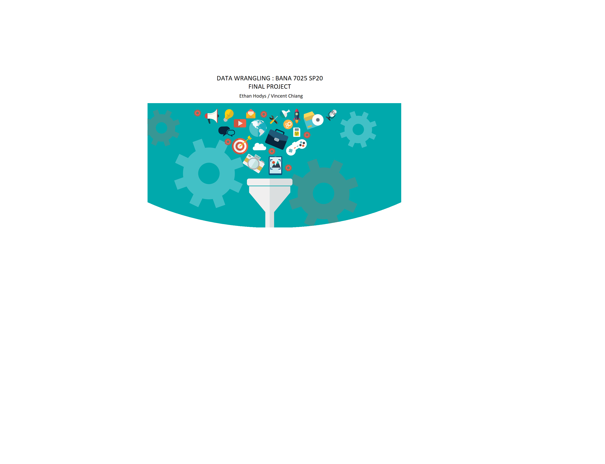

```{r setup, include=FALSE}
library(flexdashboard)
library(knitr)
library(dlookr)
library(dplyr)
library(tidyverse) # general utility functions
library(purrr)
library(tidyr)
library(ggplot2)
library(DT)
library(rsconnect)
library(corrplot)
```

```{r global, include=FALSE}
# load data in 'global' chunk so it can be shared by all users of the dashboard
spotify.raw <- readr::read_csv("finalproject.data.csv")
```


Sidebar {.sidebar}
=======================================================================

### Adjust the value to update the chart

Put some text here for the slider


```{r}
# Rate at which to flag high download traffic
sliderInput("sliderInputVal", "Replace This text:",
            min = 0, max = 50, value = 3, step = 0.1
)
# Maximum number of raw data rows to keep
numericInput("maxrows", "Recent downloads window:", 50)
```

About 
=======================================================================

Column {data-width=160, data-height=1800}
-----------------------------------------------------------------------

````{r, fig.width=9, fig.height=10}
 
```


Introduction 
=======================================================================

Row {data-height=200}
-------------------------------------

### About Spotify
Founded in 2006, Spotify's primary business is providing an audio streaming platform, the "Spotify" platform, that provides DRM-restricted music, videos and podcasts from record labels and media companies (Wikipedia 2008).  This paper is an exploratory survey of whether musical features and characteristics can be used predict how a song will be both received and classified by Spotify users.  Using different methods for Classification Trees and Clustering in R, we make a case for the feasibility of prediction using a song's meta data stored by Spotify.

```{r}
```

Row {data-height=350}
-------------------------------------
   
### Project Abstract

Music can have a powerful effect upon people emotionally and has played an important role in since the first human society.  Thus, being able to classify songs based on their musical features could prove to be a useful tool across many sectors.  While this paper will in no way be an exhaustive survey of the topic it will provide an initial exploratory analysis to help guide future research
We have chosen to use the "Spotify Song Attributes" data set on Kaggle uploaded by George McIntire under a CC-BY License.  Below is a list of the variables in the dataset with their distributions except for "track id" which is simply a unique identifier for a song (see appendix for details on the dataset). 

We also added information on the biological sex of the performers using lists of popular names split between boy in girl.  We import the data into MS Sql Server to add the correct value for the new variable "isMale" which is a simple bit variable of 0/1 for female/male, respectively.


Packages 
=======================================================================

Row {data-height=200}
-------------------------------------
### Project Libraries

</br>
</br>

- library(flexdashboard)
- library(knitr)
- library(dlookr)
- library(dplyr)
- library(tidyverse) # general utility functions
- library(purrr)
- library(tidyr)
- library(ggplot2)
- library(corrplot)

Datatable
=======================================================================

Row {}
-----------------------------------------------------------------------

### Datatable
</br>
</br>

```{r}

mydata <- spotify.raw[,12:20]
DT::datatable(mydata )
#renderDataTable({
#DT::datatable(order[1: as.numeric(input$sliderInputVal),])
# mydata <- mydata[1:as.numeric(input$sliderInputVal),]
  #DT::datatable(mydata )
#})

```


Exploration
=======================================================================

Column {data-width=650}
-----------------------------------------------------------------------

### Histogram of Dataset Variables


```{r}
spotify.raw %>%
  keep(is.numeric) %>% 
  gather() %>% 
  ggplot(aes(value)) +
  facet_wrap(~ key, scales = "free") +
  geom_histogram(color = "#e9ecef")
```


More Exploration
=======================================================================

Column {data-width=650}
-----------------------------------------------------------------------

### Histogram of Dataset Variables


```{r}
col=c(4,12:24)
data <- spotify.raw
cordata=data[,col]
datacor=cor(cordata)

corrplot(datacor, type="upper")
box1=boxplot(cordata$danceability, main= "Danceability")
box2=boxplot(cordata$energy, main="Energy")
box3=boxplot(cordata$key, main="Key")        
box4=boxplot(cordata$loudness, main="Loudness")
box5=boxplot(cordata$speechiness, main = "Speechiness")
box6=boxplot(cordata$acousticness, main="Acousticness")
box7=boxplot(cordata$liveness, main = "Liveness")
box8=boxplot(cordata$valence, main = "Valence")
box9=boxplot(cordata$tempo, main = "Tempo")
```


Analytics - 1
=======================================================================

row { }
-----------------------------------------------------------------------

### MyFirstChart

```{r}
# order <- spotify.raw %>%
#   #arrange(desc(track_popularity))
#   group_by(track_name) %>%
#   top_n(100,track_popularity) %>%
#   select(track_name, track_artist, track_popularity) %>%
#   slice(1:10) 

order <- spotify.raw %>%
  group_by(track_id,Song=track_name,Popularity=track_popularity,Artist=track_artist,
           Album=track_album_name, Relase_Date = track_album_release_date) %>%
   summarise(n_distinct(10,track_id)) %>%
   arrange(desc(Popularity))  %>%
  top_n(100,Popularity)
  #select(track_id, count(track_id))

# ugh <- order %>% 
#   top_n(10, track_popularity)


#%>%
  # top_n(100,track_popularity) %>%
  # select(track_name, track_artist, track_popularity) %>%
  #slice(1:20)  
  #top_n(20,desc(track_popularity))
renderDataTable({
DT::datatable(order[1: as.numeric(input$sliderInputVal),2:6])
})
```


<!-- ```{r} -->
<!-- library(dplyr) -->
<!-- library(reshape) -->
<!-- library(ggplot2) -->
<!-- music <- spotify.raw -->

<!-- # Top 5 Songs -->
<!-- m5 <- music[c(1:5),] -->
<!-- m5<- m5[, c(2,4,5,9,10,12,13)]  -->
<!-- m5<- as.data.frame(m5) -->
<!-- m5.long <- melt(m5, id.vars="track_name") -->

<!-- mp1<- ggplot(data=m5.long, aes(x=variable, y=value))+geom_bar(aes(y=value, fill=track_name),stat="identity", alpha=0.8 , position="dodge")+ ylab("Value")+ xlab("Variables to a song")+coord_flip()+ggtitle("Top 5 songs in Spotify 2017 ") -->
<!-- mp1 -->


<!-- # music$artists <- music$track_artist -->
<!-- # # Top artists -->
<!-- # a1 <- group_by(music, artists ) -->
<!-- # a2 <- dplyr::summarise(a1,  count=n()) -->
<!-- # a2 <- arrange(a2, desc(count)) -->
<!-- # a3 <- filter(a2, count>1) -->
<!-- # a4<- merge (music, a2, x.by=artists) -->
<!-- # a5 <- group_by(a4, count) -->
<!-- # a6 <- summarise(a5,  -->
<!-- #                    adance= mean(danceability), aenergy=mean(energy),  aspeech=mean(speechiness),aacous= mean(acousticness) , alive=mean(liveness) ,avalence=mean(valence)) -->
<!-- #  -->
<!-- # # reshape it to the long format -->
<!-- # a66<- as.data.frame(a6) -->
<!-- # a66.long <- melt(a66, id.vars="count") -->
<!-- # a66.long <- a66.long[with(a66.long, order(variable)),] -->
<!-- #  -->
<!-- # #circle bar plot -->
<!-- # mdata1 <- a66.long -->
<!-- # mdata1$id=seq(1, nrow(mdata1)) -->
<!-- # mlabel_data1=mdata1 -->
<!-- # mnumber_of_bar1=nrow(mlabel_data1) -->
<!-- # angle1m= 90 - 360 * (mlabel_data1$id-0.5) /mnumber_of_bar1  -->
<!-- # mlabel_data1$hjust<-ifelse( angle1m < -90, 1, 0) -->
<!-- # mlabel_data1$angle<-ifelse(angle1m < -90, angle1m+180, angle1m) -->
<!-- #  -->
<!-- # mp <- ggplot(mdata1, aes(x=as.factor(id), y=value, fill=variable))+geom_bar(stat="identity", alpha=0.8) + ylim(-50,120)+theme_minimal()+theme( -->
<!-- #     axis.text = element_blank(), -->
<!-- #     panel.grid = element_blank(), -->
<!-- #     plot.margin = unit(rep(-1,6), "cm")  ) + -->
<!-- #   coord_polar()+ -->
<!-- #   geom_text(data=mlabel_data1, aes(x=id, y=value+10, label=count, hjust=hjust), color="black", fontface="bold",alpha=0.6, size=3, angle= mlabel_data1$angle, inherit.aes = FALSE ) + ggtitle("d")  -->
<!-- #   -->
<!-- # mp -->
<!-- ``` -->


Project Summary
=======================================================================

Column {data-width=650}
-----------------------------------------------------------------------

### Chart A

- Used Flexdashboard
- Used Data Input within Flexdashboard
- Use dplyr techniques from class for creating bins of variables such as danceability and popularity
- Deployed to personal shinyapps.io site via rsconnect()
- Deployed code to GitHub for source control and collaboration

```{r}
#renderPlot. 
```

